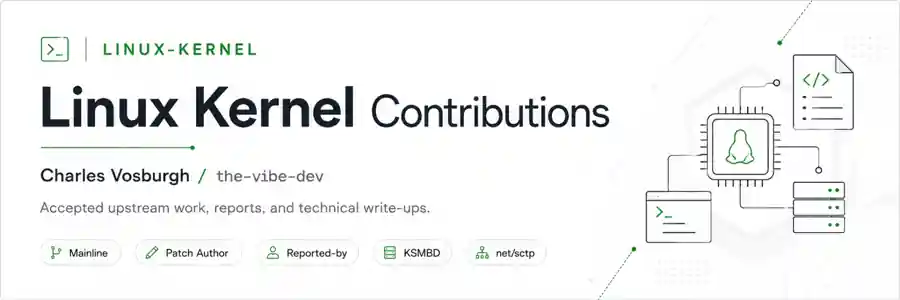

<p align="center">
  
</p>

# Linux Kernel Contributions

<p align="center">
  
  
  
</p>

<p align="center">
  
  
  
</p>

<p align="center">
  Upstream Linux kernel contributions by <strong>Charles Vosburgh</strong> / <strong><code>the-vibe-dev</code></strong>.
</p>

This repository tracks my **accepted Linux kernel contributions and upstream technical write-ups** separately from my CVE/GHSA security research portfolio. It is intended to grow as additional patches, reports, reviews, and subsystem contributions are accepted upstream.

My CVE and GitHub Security Advisory work is maintained separately in [`the-vibe-dev/CVE-GHSA`](https://github.com/the-vibe-dev/CVE-GHSA).

---

## Contribution snapshot

| Metric | Count |
|---|---:|
| Accepted mainline contributions | **3** |
| Patches authored and signed off by Charles Vosburgh | **1** |
| Accepted fixes carrying `Reported-by: Charles Vosburgh` | **2** |
| Linux subsystems represented | **2** |

Current upstream areas: **SCTP networking (`net/sctp`)** and **KSMBD (`fs/smb/server`)**.

---

## Mainline contributions

| # | Mainline commit | Subsystem | Contribution | Role | Write-up |
|---:|---|---|---|---|---|
| 01 | [`74b21f52c5c5`](https://github.com/torvalds/linux/commit/74b21f52c5c5a71a05c0ff70e513f4f04ff28b17) | `net/sctp` | **sctp: validate Adaptation Indication parameter length** | **Patch author + `Signed-off-by`** | [Read](contributions/74b21f52-sctp-adaptation-indication-length/) |
| 02 | [`e148e567a925`](https://github.com/torvalds/linux/commit/e148e567a9252643baa125cb65d7ae9c2c6cf68a) | `fs/smb/server` | **ksmbd: preserve VFS inherited POSIX ACL mask** | **`Reported-by`** — patch by Namjae Jeon | [Read](contributions/e148e567-ksmbd-posix-acl-mask/) |
| 03 | [`2bebf2470af1`](https://github.com/torvalds/linux/commit/2bebf2470af1a72f87754a5c7b21e86af32b9c8f) | `fs/smb/server` | **ksmbd: enforce signing required by the session** | **`Reported-by`** — patch by Namjae Jeon | [Read](contributions/2bebf247-ksmbd-session-signing/) |

---

## Contribution roles

Linux contribution credit is represented exactly as recorded upstream.

### Patch author

For [`74b21f52c5c5`](https://github.com/torvalds/linux/commit/74b21f52c5c5a71a05c0ff70e513f4f04ff28b17), the mainline commit records:

```text
Signed-off-by: Charles Vosburgh <the-vibe-dev@users.noreply.github.com>
Acked-by: Xin Long <lucien.xin@gmail.com>
Signed-off-by: Jakub Kicinski <kuba@kernel.org>
```

The GitHub mirror also attributes the commit author to [`the-vibe-dev`](https://github.com/the-vibe-dev).

### Reporter

For the two KSMBD fixes, the mainline commits record:

```text
Reported-by: Charles Vosburgh <the-vibe-dev@users.noreply.github.com>
```

Namjae Jeon authored both accepted patches and Steve French signed them into the SMB tree. The write-ups preserve that distinction rather than presenting reporting credit as patch authorship.

---

## Repository layout

This repository is intentionally **writeup-focused**:

```text
Linux-Kernel/
├── README.md
└── contributions/
    ├── 74b21f52-sctp-adaptation-indication-length/
    │   └── README.md
    ├── e148e567-ksmbd-posix-acl-mask/
    │   └── README.md
    └── 2bebf247-ksmbd-session-signing/
        └── README.md
```

Each contribution README documents the problem, affected boundary, accepted upstream change, validation approach, impact, version/fix information, upstream credit, and broader engineering lesson. Raw private research artifacts, credentials, lab captures, and unpublished harnesses are not included.

---

## Contribution approach

The write-ups distinguish between:

- **patch authorship**, `Signed-off-by`, `Reported-by`, review, and maintainer credit;
- the exact behavior demonstrated during research and broader behavior inferred from source;
- public upstream version boundaries and independently checked releases;
- the original failure mode and the security/correctness invariant restored by the accepted patch;
- mainline inclusion and stable backports when independently established.

The objective is to document not just *what changed*, but **why the old behavior was unsafe or incorrect and why the upstream fix restores the intended kernel boundary**.

---

## Contributor

**Charles Vosburgh** — [`the-vibe-dev`](https://github.com/the-vibe-dev)

Independent security researcher and Linux kernel contributor working across protocol validation, filesystem/ACL behavior, SMB/KSMBD security boundaries, and low-level vulnerability analysis.

## Responsible use

Technical reproduction details in this repository are intended for defensive research, regression testing, patch verification, and systems the reader owns or is explicitly authorized to assess.
