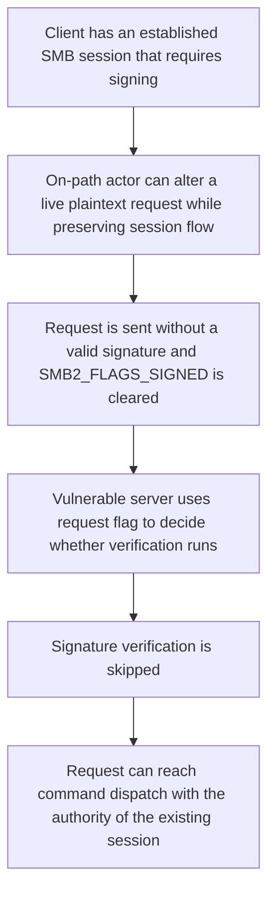

# ksmbd: enforce signing required by the session

**Linux mainline:** [`2bebf2470af1a72f87754a5c7b21e86af32b9c8f`](https://github.com/torvalds/linux/commit/2bebf2470af1a72f87754a5c7b21e86af32b9c8f)  
**Subsystem:** `fs/smb/server` / KSMBD  
**Role:** **`Reported-by`**  
**Reporter:** Charles Vosburgh (`the-vibe-dev`)  
**Patch author:** Namjae Jeon

---

## At a glance

| Field | Value |
|---|---|
| Mainline commit | `2bebf2470af1a72f87754a5c7b21e86af32b9c8f` |
| Commit title | `ksmbd: enforce signing required by the session` |
| Files changed | `fs/smb/server/server.c`, `fs/smb/server/smb2pdu.c` |
| Public credit | `Reported-by: Charles Vosburgh` |
| Patch author | Namjae Jeon |
| Additional upstream review | Tested/Reviewed by ChenXiaoSong; signed off by Steve French |
| First verified mainline tag containing fix | `v7.2-rc5` |
| Security class | Mandatory message-integrity policy selected by untrusted request metadata |

## Summary

KSMBD stores whether SMB signing is required in trusted session state. Before this fix, request processing could nevertheless use the **incoming request's own `SMB2_FLAGS_SIGNED` bit** to decide whether signature verification should run.

That reverses the trust relationship. The packet-controlled flag tells the server whether the request *claims* to carry a signature; it must not decide whether the authenticated session's signing policy is enforced.

In the vulnerable path, an unsigned plaintext request inside a signing-required session could clear `SMB2_FLAGS_SIGNED`, avoid the signature-verification branch, and continue toward command dispatch using the authority already associated with the live SMB session.

The accepted patch enforces mandatory signing from `work->sess->sign` before dispatch and continues to verify signatures whenever a signed request is present. It also removes an incorrect `SMB2_OPLOCK_BREAK` exclusion from signed-request detection.

**Security invariant:** Once an SMB session requires signing, the server must enforce that policy from authenticated session state. An incoming request may indicate that it carries a signature, but it may never decide whether signing is required.

---

## SMB signing boundary

SMB signing protects the integrity and authenticity of requests inside an established session. KSMBD already has the required policy state:

```text
work->sess->sign
```

The incoming SMB2 header also contains:

```text
SMB2_FLAGS_SIGNED
```

These values answer different questions:

- `sess->sign`: **Does the session require signing?**
- `SMB2_FLAGS_SIGNED`: **Does this particular request claim to contain a signature?**

A secure server should consult the first value to decide whether an unsigned plaintext request is allowed at all, and the second value to decide whether a present signature needs verification.

---

## Vulnerable request flow

Before the accepted patch, `__process_request()` checked signatures only if the protocol helper reported the request as signed:

```c
if (work->sess && conn->ops->is_sign_req(work, command)) {
	ret = conn->ops->check_sign_req(work);
	...
}
```

For SMB2, `is_sign_req()` primarily reflected the packet's `SMB2_FLAGS_SIGNED` bit.

That meant an attacker capable of altering a live plaintext SMB request could clear the bit that would have sent the message through signature verification. The server's trusted session state could say “signing required,” while the untrusted message could say “this request is not signed” and thereby skip the check.

The bug is therefore not “signature verification accepts a bad signature.” A corrupt **signed** request can still be rejected. The flaw is that a signing-required session could allow an **unsigned** request to avoid the verification path entirely.

---

## Root cause

Mandatory integrity policy was anchored to message metadata instead of authenticated session state.

| Boundary | Result |
|---|---|
| Trusted policy | `work->sess->sign` says signing is required |
| Attacker-controlled metadata | SMB2 `Flags` / `SMB2_FLAGS_SIGNED` |
| Vulnerable decision | Run verification only when the request marks itself signed |
| Consequence | Clearing the signed flag can bypass the mandatory verification branch |

This is a general security-policy mistake: **untrusted input can describe compliance, but it cannot select whether enforcement occurs**.

---

## Accepted upstream fix

Mainline commit [`2bebf2470af1`](https://github.com/torvalds/linux/commit/2bebf2470af1a72f87754a5c7b21e86af32b9c8f) separates “signing is required” from “the request is signed.”

The patch computes the request state once:

```c
signed_req = conn->ops->is_sign_req &&
	     conn->ops->is_sign_req(work, command);
```

It then enforces the session requirement **before dispatch**:

```c
if (work->sess && work->sess->sign && !work->encrypted &&
    !signed_req) {
	conn->ops->set_rsp_status(work, STATUS_ACCESS_DENIED);
	return SERVER_HANDLER_ABORT;
}
```

Signed requests are still verified whether signing is mandatory or optional:

```c
if (work->sess && signed_req) {
	ret = conn->ops->check_sign_req(work);
	if (!ret) {
		conn->ops->set_rsp_status(work, STATUS_ACCESS_DENIED);
		return SERVER_HANDLER_ABORT;
	}
}
```

The patch also changes SMB2 signed-request detection so `SMB2_OPLOCK_BREAK` is no longer excluded from the normal signing rule:

```diff
 if ((rcv_hdr2->Flags & SMB2_FLAGS_SIGNED) &&
-	command != SMB2_NEGOTIATE_HE &&
-	command != SMB2_OPLOCK_BREAK_HE)
+	command != SMB2_NEGOTIATE_HE)
 	return true;
```

The accepted commit message records these credit roles:

```text
Reported-by: Charles Vosburgh
Tested-by: ChenXiaoSong
Reviewed-by: ChenXiaoSong
Signed-off-by: Namjae Jeon
Signed-off-by: Steve French
```

Charles Vosburgh is therefore the **reporter**, while Namjae Jeon is the accepted patch author.

---

## Attack path



The demonstrated threat model is therefore **same-session/on-path**, not an off-path unauthenticated session takeover.

A practical attacker needs enough control over the live SMB/TCP flow to preserve the existing authenticated session while replacing or modifying a request.

---

## Validation approach

The original validation used an owned disposable KSMBD environment with SMB signing required and compared three message shapes inside the same general session policy:

### Correctly signed request

Establishes that valid signed traffic continues to work.

### Corrupt signed request

Confirms that signature verification is active and that an invalid signature is denied.

### Unsigned request in the signing-required session

Exercises the policy bypass. Under the vulnerable behavior, clearing `SMB2_FLAGS_SIGNED` prevents the request from entering `check_sign_req()`.

The retained validation demonstrated a bounded same-flow integrity result: a corrupt signed write was denied while an unsigned write in the signing-required session reached the backend state. The accepted patch changes the enforcement point so the unsigned plaintext request is rejected before dispatch.

No executable private harness or raw packet capture is published in this repository.

---

## Impact and limits

The demonstrated impact is a failure of SMB message integrity inside an already established signing-required session. If an on-path actor can preserve the live session state while altering a victim request, the vulnerable server can process an unsigned request without cryptographic authentication.

The authority available to that request remains the authority of the existing SMB session. The research does **not** demonstrate:

- off-path session creation or takeover;
- bypass of user authentication itself;
- authority beyond the victim session;
- arbitrary kernel memory access;
- code execution;
- privilege escalation outside the SMB permissions already associated with the session.

Encrypted SMB requests are a separate case because they have already been authenticated during decryption; the patch explicitly excludes encrypted requests from the missing-signature rejection branch.

The upstream commit does not assign a CVE or CVSS score, so this repository does not invent one.

---

## Version information

The accepted commit fixes the pre-existing mainline behavior but does not publish a complete affected-version range.

The original validation reproduced the issue on Linux **v7.1.3**. Public tag containment checks found the fix absent from **v7.2-rc4** and present in **v7.2-rc5**.

The exact introducing commit was not independently identified during the bounded review.

Consumers should verify their own vendor/stable kernel branch directly rather than infer patch presence from this mainline boundary alone.

---

## Regression guidance

A useful signing regression suite should assert policy from **session state**, not from incoming message claims.

At minimum, test:

1. signing-required session + valid signed request → accepted;
2. signing-required session + invalid signed request → rejected;
3. signing-required session + unsigned plaintext request → rejected before dispatch;
4. signing-optional session + valid signed request → signature still verified;
5. signing-optional session + permitted unsigned request → behavior matches negotiated policy;
6. encrypted request → handled through the authenticated encryption path;
7. signed `SMB2_OPLOCK_BREAK` acknowledgement → normal signature handling applies.

**Regression invariant:** A request can report whether it carries a signature, but the requirement to authenticate that request must come from trusted session policy.

---

## Timeline

| Date / release | Event |
|---|---|
| July 2026 | Issue reported by Charles Vosburgh to the KSMBD maintainers. |
| July 17, 2026 | Fix authored by Namjae Jeon. |
| July 22, 2026 | Commit `2bebf2470af1` recorded in upstream history. |
| Linux 7.2-rc5 | First verified mainline tag containing the fix. |

---

## Upstream references

- [Linux mainline commit — 2bebf2470af1](https://github.com/torvalds/linux/commit/2bebf2470af1a72f87754a5c7b21e86af32b9c8f)
- [git.kernel.org commit view](https://git.kernel.org/pub/scm/linux/kernel/git/torvalds/linux.git/commit/?id=2bebf2470af1a72f87754a5c7b21e86af32b9c8f)

## Credit

**Charles Vosburgh (`the-vibe-dev`)** — reporter, credited by the accepted upstream commit's `Reported-by` trailer.

**Namjae Jeon** — patch author.  
**ChenXiaoSong** — tested and reviewed the accepted patch.  
**Steve French** — upstream sign-off / SMB tree integration.

## Research conclusion

The vulnerable KSMBD request path allowed an untrusted SMB2 header flag to decide whether a signing-required session would perform signature verification. Clearing the flag could therefore suppress the very enforcement the session policy required. The accepted patch restores the correct trust relationship by rejecting unsigned plaintext requests based on `sess->sign` before command dispatch.

**Broader lesson:** Mandatory security controls must be anchored in authenticated state. Untrusted input may carry evidence of compliance, but it must never control whether the compliance check runs.
